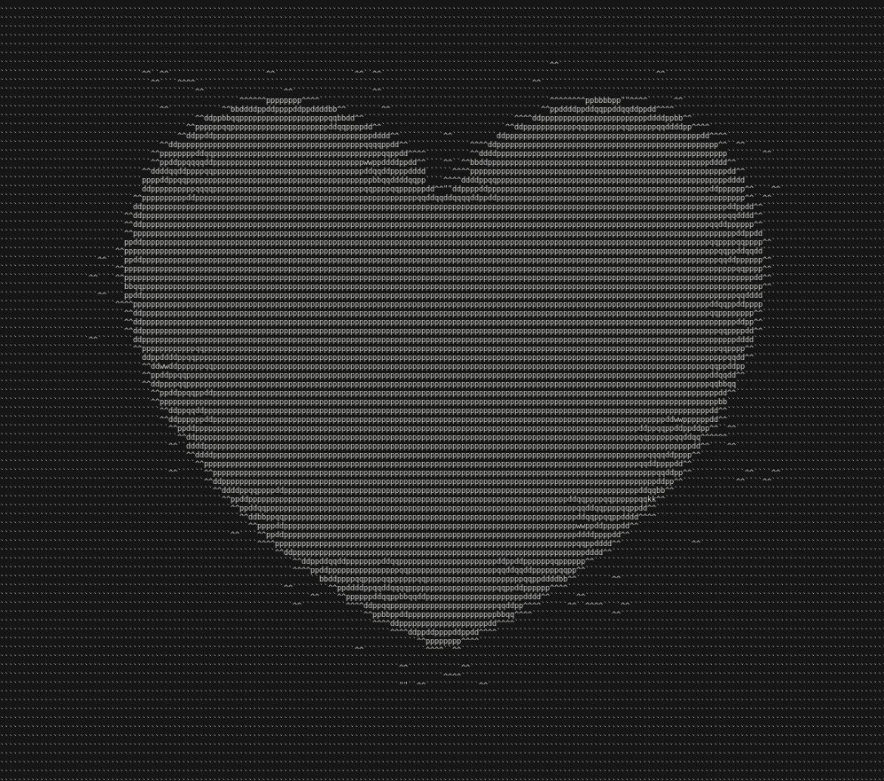

# ASCII art

Makes pictures into ASCII art.

You can use `python 3 ascii.py path_to_image` or `python3 ascii.py path_to_image max_width_in_pixel`

Works better with small images. If the ASCII art is squished, make the window bigger or the font size smaller (ctrl + -).

